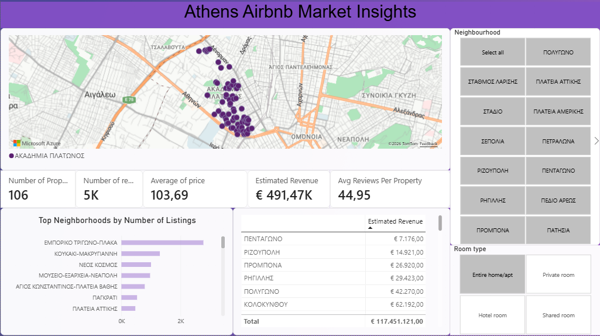
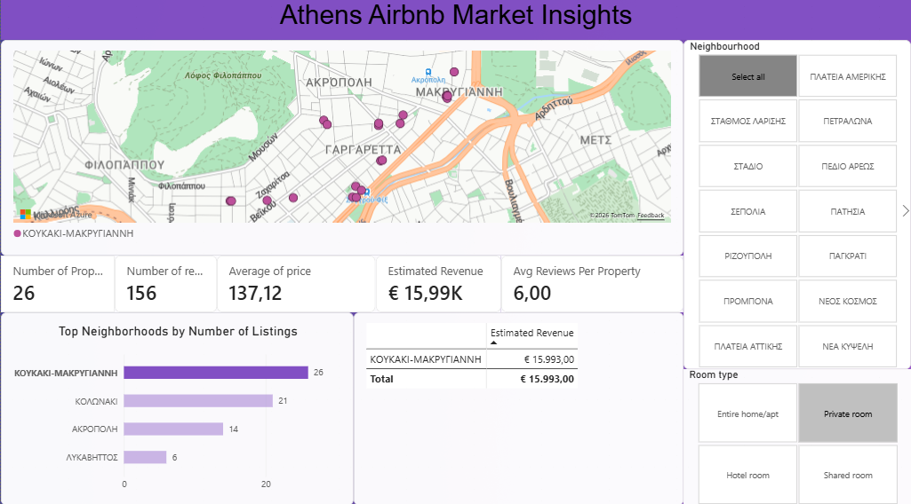

# Athens Airbnb Market Analysis: Investment Opportunity Insights

## 📌 Project Overview
This project focuses on analyzing real-world Airbnb data from Athens, Greece, to identify key trends and investment opportunities in the short-term rental market. The goal is to provide data-driven insights for a hypothetical investor looking to purchase property in Athens for maximum profitability.

The analysis covers price distributions across neighborhoods, property popularity based on demand (reviews), and specific metrics generated through SQL analysis.

## 🛠️ Tech Stack & Tools
* **Python 3.13** (Data Loading, Cleaning & Exploratory Data Analysis)
* **Pandas & NumPy** (Data Manipulation)
* **Matplotlib** (Data Visualization)
* **SQL (SQLite3 via Python)** (Advanced Querying & Aggregations)
* **Power BI** (Interactive Dashboard Creation)

## 📁 Repository Structure
* `athens_airbnb_clean.py` - The core Python script containing the cleaning pipeline, visual analysis, and SQL queries.
* `athens_airbnb_clean.csv` - The finalized, clean dataset exported after the Python pipeline.
* `README.md` - Project documentation and executive summary.

## 🧹 Data Cleaning Pipeline (Python)
The raw dataset from Inside Airbnb was optimized through the following steps:
1. **Feature Selection:** Filtered down from 70+ columns to the 8 most critical variables (neighborhood, price, coordinates, room type, reviews, etc.).
2. **Data Type Correction:** Converted financial strings and numbers into proper float formats for computational accuracy.
3. **Missing Value Management:** Maintained integrity by cleansing and handling null values across active listings.
4. **Exporting:** Generated a clean CSV file (`athens_airbnb_clean.csv`) prepared for BI dashboards.

## 📊 Key Insights & Business Findings

### 1. High-End Real Estate Hotspots
* **Rigillis (ΡΗΓΙΛΛΗΣ)** emerged as the most expensive neighborhood by average price per night. This highlights the premium nature of the area surrounding Kolonaki and the Presidential Mansion, pinpointing where luxury-tier investments should focus.

### 2. Supply vs. Demand by Room Type
* **Entire homes/apartments** dominate the Athens market overwhelmingly. They hold the highest number of listings and generate the vast majority of user reviews (demand proxy). Tourists visiting Athens strongly prefer complete privacy over shared spaces, marking this as the primary property type for new buyers.

### 3. SQL Data Insights
Through SQLite queries, the following metrics were established:
* **Market Saturation:** Identified which neighborhoods have the highest percentage of entire homes dedicated to Airbnb.
* **Estimated Revenue Leaders:** Tracked top-performing properties by multiplying price with review volume to approximate maximum turnover.

---
*Developed as part of a professional Data Analytics portfolio.*
